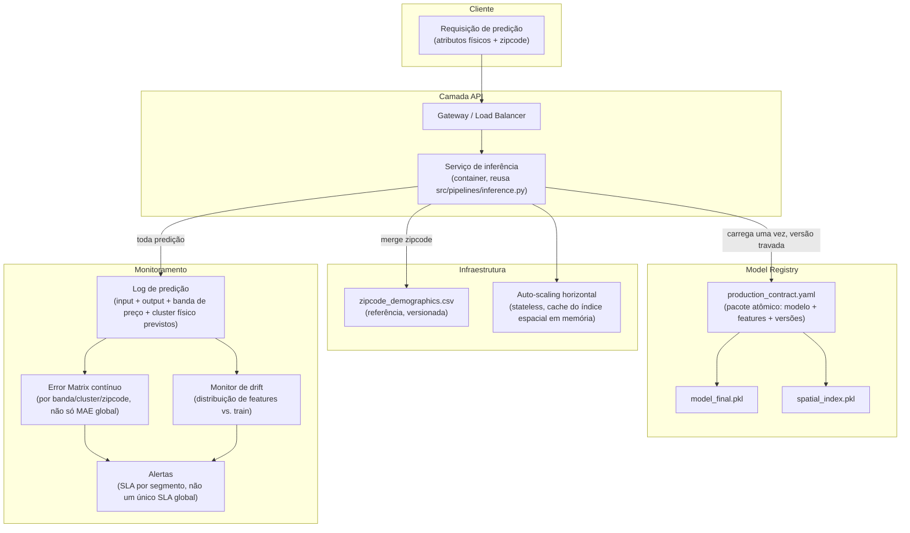

# 07 — Estratégia de Deploy (Entregável 3)

Documento, não implementação (README oficial do teste, seção "Estratégia de Deploy"). Segue `P6`
(`roadmap/PRINCIPLES.md`) — produção nunca é atualizada automaticamente; contrato de produção é um
pacote atômico versionado, distinto do experimental.

## 1. Objetivo

Colocar `artifacts/model_final.pkl` (fase 13, refit `train`+`test`, MAE em `val` \$72.517) atrás de uma
API de inferência com paridade treino/produção garantida por construção (reuso de código, não
reimplementação), monitorada por segmento — não só por uma métrica agregada — porque o próprio projeto
demonstrou (fase 11/13) que o erro varia 2-4x entre segmentos e que uma métrica global pode esconder
degradação localizada (ex: a decisão de augmentation da fase 05 parecia boa pelo CV agregado e só a
quebra por segmento, na fase 11, revelou o problema real).

## 2. Diagrama de camadas

## 3. Camada API

**Endpoint de inferência** reusa `src/pipelines/inference.py::predict_price` — a MESMA função usada na
demo de inferência da fase 14, não uma reimplementação em outra linguagem/serviço (P5: paridade
treino/produção garantida por reuso de código, não por promessa de manter duas implementações
sincronizadas manualmente). Contrato de entrada: os mesmos campos de `future_unseen_examples.csv`
(sem `id`/`date`/`price` — o serviço não exige histórico de venda do imóvel, só atributos físicos +
`zipcode`). `property_age` é calculado a partir da data da requisição (`as_of_date`), não de uma venda
passada — decisão de design já validada na fase 14.

**Saída da API** inclui, além do preço previsto: a banda de preço (`price_band`) e o cluster físico
(`property_cluster`) previstos — não só o número — porque o monitoramento por segmento (seção 5)
depende de saber a qual segmento cada predição pertence, sem precisar reprocessar.

## 4. Model Registry

`production_contract.yaml` (gerado por `scripts/write_production_contract.py`, fase 14) é o pacote
atômico: schema de features (20 features oficiais, `data/trusted/feature_metadata.json`), versão de
modelo, versão do dataset de treino (`data/processed/house_clean.parquet` + `data/trusted/
features_contextual.parquet`), versão do split (`data/processed/split_metadata.json`), versão do
pré-processamento (índice espacial k=30, fit só em `train`), e **limitações conhecidas explícitas**
(erro por segmento, lição da reversão de augmentation). Nunca versões soltas — reescalar features sem
atualizar o encoding/índice correspondente quebra o contrato por definição.

**Promoção (P6):** `status: RECOMMENDED_FOR_PROMOTION` é uma recomendação do pipeline
(`make evaluate` + `make finalize`), nunca uma substituição executada automaticamente. Fluxo:
`candidate → avaliação (fase 11/13) → promotion contract (fase 14) → aprovação humana → produção`.

## 5. Monitoramento (adição explícita sobre o `docs/07` do projeto anterior)

**Não só MAE global.** O serviço de inferência loga banda de preço e cluster físico previstos junto de
cada predição (seção 3); o monitor recalcula periodicamente um Error Matrix (mesma lógica de
`src/evaluation/error_matrix.py`, fase 11) sobre o lote de predições recentes — quando o resultado real
da venda estiver disponível (ver `08_continuous_learning.md`), a métrica por segmento é comparada contra
o baseline do `production_contract.yaml`.

**SLA diferenciado por segmento**, não um único SLA global — motivado diretamente pelo achado do
projeto: erro em `Luxury`/`waterfront`/`grade≥10` é 2-4x o do mercado de massa (fase 11/13). Um SLA
único (ex: "MAE < \$80k") seria trivialmente violado em `Luxury` e mascarado pela maioria das predições
de mercado de massa numa métrica agregada. SLA sugerido:

| Segmento | MAE alvo | Ação se violado |
|---|---|---|
| Entry/Standard | < \$60k | Alerta de degradação padrão |
| Premium | < \$90k | Alerta de degradação padrão |
| Luxury / waterfront / grade≥10 | < \$220k (~ baseline atual) | Revisão manual antes de qualquer decisão de negócio automatizada sobre esses imóveis |

**Monitor de drift:** compara a distribuição das features de entrada em produção contra a distribuição
de `train` (mesma lógica de `src/evaluation/geographic_coverage.py::feature_space_coverage`, fase 04) —
um lote de predições sistematicamente "fora da cobertura" de `train` é sinal de que o modelo está
extrapolando, não interpolando, e deveria disparar alerta antes que o erro real apareça.

## 6. Infraestrutura

Serviço stateless (o índice espacial `spatial_index.pkl` e o modelo são carregados uma vez em memória
no boot do container, não por requisição) — permite auto-scaling horizontal padrão sem estado
compartilhado. `zipcode_demographics.csv` é a única dependência de dado externo em tempo de inferência
(além do próprio request) — versionada junto do contrato, não uma chamada a serviço externo.
