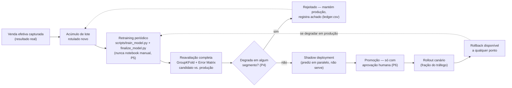

# 08 — Aprendizado Contínuo (Entregável 4)

Documento (README oficial do teste, seção "Aprendizado Contínuo"). Segue `P4`/`P6`
(`roadmap/PRINCIPLES.md`) — critério de substituição checa degradação por segmento, não só agregada;
promoção nunca é automática.

## 1. Ciclo completo

## 2. Captura de resultado real

Cada predição já loga banda de preço e cluster físico previstos (`07_deploy_strategy.md`, seção 3).
Quando a venda efetiva de um imóvel previsto se concretiza (fonte externa — registro público de venda,
integração com o sistema de transação), o par `(features da requisição, preço real)` vira uma linha de
dado rotulado novo — mesmo schema de `kc_house_data.csv`, sem precisar de re-anotação manual.

## 3. Acúmulo e retraining periódico

Lotes de dados rotulados novos se acumulam em `data/raw/` (nunca sobrescrevendo o raw original, P1) até
atingir um volume mínimo que justifique retraining (ex: N≥500 vendas novas, ou um intervalo fixo — ex:
trimestral — o que vier primeiro). Retraining roda via `scripts/train_model.py` +
`scripts/finalize_model.py` (o mesmo pipeline usado nas fases 10/13 desta execução), **nunca notebook a
notebook manualmente** (P5) — garante que o candidato novo passa pelas mesmas etapas
(segmentação → features → ablation → seleção de modelo → refit final) que o modelo atual passou,
sem atalho.

## 4. Reavaliação — critério de substituição por segmento (adição explícita)

O `docs/08` do projeto anterior já continha o germe disso ("distribuição de erro por faixa de preço e
por zipcode não pode piorar") — aqui vira regra formal via Error Matrix comparativo, não checagem
ad-hoc, e é a lição mais concreta que esta própria execução produziu: a fase 05 adotou uma técnica de
augmentation que melhorava a métrica agregada de treino (CV -20,5%) mas piorava a generalização real
(`test` +8,8%) — só descoberto porque a fase 11 quebrou o resultado por segmento em vez de aceitar o
número agregado. **O critério de substituição em produção aplica a mesma disciplina:**

- Candidato treinado com o pipeline completo (fases 06-13 desta execução, reaplicadas ao dado
  acumulado).
- `GroupKFold` por zipcode sobre o `train` do candidato (nunca holdout aleatório, P1).
- Error Matrix comparativo candidato vs. produção atual, quebrado por banda de preço, cluster físico,
  característica (`waterfront`/`grade≥10`/`view`/renovado) e zipcode (P3).
- **Critério de aceite:** promove só se o candidato não piorar o MAE em **nenhum segmento** do SLA
  (`07_deploy_strategy.md`, seção 5) em mais de uma margem tolerável (ex: 2%, mesmo padrão usado nos
  critérios de aceite das fases 05/12 desta execução) — mesmo que a métrica agregada melhore. Uma
  melhoria agregada que esconde piora em `Luxury`/`waterfront` é rejeitada, não promovida.

## 5. Shadow deployment

Candidato aprovado na reavaliação roda em paralelo à produção (mesmo tráfego real, predições não
servidas ao cliente) por um período mínimo (ex: 2 semanas ou volume equivalente ao usado na reavaliação
offline) — confirma que o comportamento em dado de produção real bate com a reavaliação offline antes
de qualquer decisão de promoção.

## 6. Promoção — nunca automática (P6)

Resultado do shadow deployment + Error Matrix comparativo é apresentado para aprovação humana explícita
— o pipeline recomenda (`status: RECOMMENDED_FOR_PROMOTION` no `production_contract.yaml` do
candidato), nunca substitui sozinho. Mesma regra de governança da fase 14 desta execução.

## 7. Rollout e rollback

Após aprovação: rollout gradual (ex: 5% → 25% → 100% do tráfego, com checkpoint de Error Matrix por
segmento em cada etapa). Rollback disponível a qualquer momento — versão anterior do
`production_contract.yaml` + `model_final.pkl` permanece versionada no Model Registry (nunca
sobrescrita), então reverter é trocar qual versão está ativa, não reconstruir o modelo anterior do zero.
