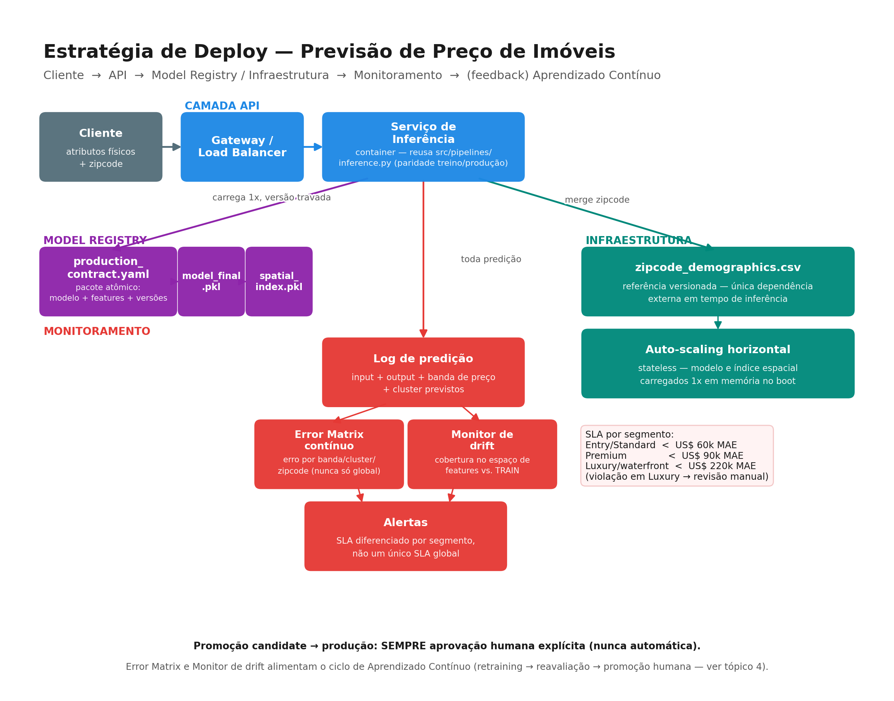

# Entregável 3 — Estratégia de Deploy

> Documento de estratégia — não é a implementação em si (embora este projeto também tenha uma
> implementação real em `app/` + `portal/`, ver nota no fim). O objetivo aqui é mostrar **como o
> modelo seria colocado em produção**: camadas, responsabilidades e por que cada decisão foi tomada.

## 1. Objetivo

Colocar o modelo treinado (XGBoost, 20 features, MAE de validação **US$ 72.517** / MAPE **14,1%**)
atrás de uma API de inferência que:

- devolve previsões com a **mesma lógica** usada em treino (sem reimplementar o pré-processamento
  numa segunda linguagem/serviço, o que criaria risco de divergência silenciosa);
- é monitorada **por segmento de imóvel**, não só por uma métrica agregada — o erro do modelo varia
  2 a 4x entre o mercado padrão e imóveis de luxo/waterfront, então uma métrica única esconderia
  degradação real num desses grupos;
- nunca promove um modelo novo para produção sozinha — toda substituição passa por aprovação humana.

## 2. Diagrama de camadas

## 3. Camada API

- **Endpoint de inferência** recebe os atributos físicos do imóvel + `zipcode` (mesmo formato de
  `future_unseen_examples.csv`, sem exigir `id`/`date`/`price`) e devolve: preço previsto, banda de
  preço (Entry/Standard/Premium/Luxury) e cluster de perfil físico previstos.
- Devolver banda e cluster junto do preço (não só o número) é o que permite ao monitoramento
  (seção 5) saber a que segmento cada predição pertence sem precisar reprocessar nada depois.
- **Paridade treino/produção por reuso de código**: o serviço de inferência chama a mesma função
  Python usada no pipeline de treino/avaliação, em vez de reescrever o pré-processamento numa
  segunda implementação — isso elimina a categoria de bug mais comum em serving de ML ("o
  pré-processamento de produção ficou levemente diferente do de treino").
- **Gateway / Load Balancer** na frente do serviço — autenticação, rate limiting e distribuição de
  carga entre réplicas, desacoplado da lógica de inferência.

## 4. Model Registry / versionamento de modelo

Modelo, schema de features e metadados de treino viajam juntos, nunca soltos — um **pacote
atômico** versionado (`production_contract.yaml`), contendo:

- versão do modelo (artefato serializado);
- schema das 20 features oficiais (nomes, tipos, ordem);
- versão do dataset de treino e do split usado para validação;
- versão do pré-processamento (ex: índice espacial de vizinhos usado para features contextuais);
- limitações conhecidas do modelo, documentadas explicitamente no próprio contrato (ex: erro maior
  em imóveis de luxo) — para que quem opera em produção veja isso sem precisar garimpar relatórios.

Versionar essas peças juntas evita o cenário clássico de "atualizei o modelo mas esqueci de
atualizar o pré-processamento que ele espera" — o contrato é tudo-ou-nada.

**Fluxo de promoção:** candidato treinado → avaliação comparativa (seção do Entregável 4) → gera um
contrato de produção com status `RECOMMENDED_FOR_PROMOTION` → **aprovação humana explícita** →
vira o contrato ativo em produção. Nunca automático.

## 5. Monitoramento

Métrica única (ex: "MAE médio de hoje") não é suficiente — ela pode melhorar globalmente enquanto
piora seriamente num segmento específico, e ninguém perceberia até o segmento errado virar uma
reclamação de negócio. Por isso:

- **Log de cada predição**: input recebido, output devolvido, banda de preço e cluster previstos.
- **Error Matrix contínuo**: quando o valor real de venda chega (Entregável 4), o erro é recalculado
  quebrado por banda de preço, cluster físico e zipcode — nunca só um número global.
- **Monitor de drift**: compara a distribuição das features recebidas em produção contra a
  distribuição vista em treino. Um lote de predições sistematicamente "fora da cobertura" de treino
  é sinal de que o modelo está extrapolando (não interpolando) — deveria alertar antes que o erro
  real apareça, não depois.
- **SLA diferenciado por segmento** (não um único SLA global):

| Segmento | MAE alvo | Ação se violado |
|---|---|---|
| Entry / Standard | < US$ 60 mil | Alerta de degradação padrão |
| Premium | < US$ 90 mil | Alerta de degradação padrão |
| Luxury / waterfront / alto padrão construtivo | < US$ 220 mil (~nível atual) | Revisão manual antes de qualquer decisão automatizada sobre esses imóveis |

Um SLA único (ex: "MAE < US$ 80 mil") seria trivialmente violado no segmento de luxo e mascarado
pela maioria das predições de mercado padrão numa métrica agregada — por isso o corte é por
segmento.

## 6. Infraestrutura

- Serviço **stateless**: modelo e índices auxiliares carregados uma única vez em memória no boot do
  container, não recarregados a cada requisição — permite auto-scaling horizontal padrão, sem
  estado compartilhado entre réplicas.
- Única dependência externa de dado em tempo de inferência: a tabela de demografia por `zipcode`
  (pequena, estática, versionada junto do contrato — não uma chamada a um serviço externo em tempo
  real).

## 7. Nota sobre a implementação já existente

Esta é uma **estratégia** documentada, mas este projeto foi além do escopo pedido e implementou uma
versão real dela: API (FastAPI) em `app/` e um portal de operação (Streamlit)
em `portal/`, ambos com Docker e testes automatizados. O que falta para produção real é
CI/CD (`.github/workflows/`) — deixado de fora conscientemente, não esquecido. Ver `app/README.md`
e `docs/DOCKER_GUIA.md` para os detalhes de como rodar essa implementação.
