# Fase 02 — EDA completo (100% dos dados, pré-split)

**Pergunta:** que correlações, distribuições, outliers e padrões geográficos existem — e como o dado se
distribui por zipcode, antes de qualquer decisão de split?

**Hipótese:** tamanho/qualidade dominam a formação de preço; existe estrutura espacial forte;
representação por zipcode é desigual o suficiente para investigar formalmente antes do split.

**Execução:** `scripts/run_eda.py`, `src/evaluation/geographic_coverage.py::zip_representation_summary`,
narrado em `notebooks/02_eda_completo.ipynb`. Substitui a antiga fase 04 (rodava só em `train`, pós-split
— agora roda sobre `data/processed/house_clean.parquet` inteiro, pré-split, P1).

## Resultado (100% dos dados, 21.612 linhas, 70 zipcodes)

Top 5 correlações com `price_log`: `grade` (0,704), `sqft_living` (0,695), `hous_val_amt` (0,631),
`sqft_living15` (0,619), `per_bchlr` (0,611). Gradiente espacial confirmado — razão de 8,0x entre
mediana de preço do zipcode mais caro (98039) e mais barato (98002).

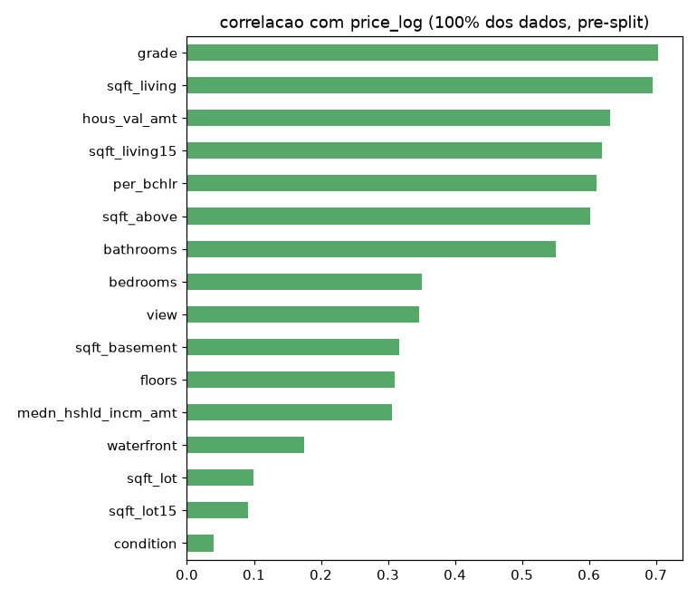
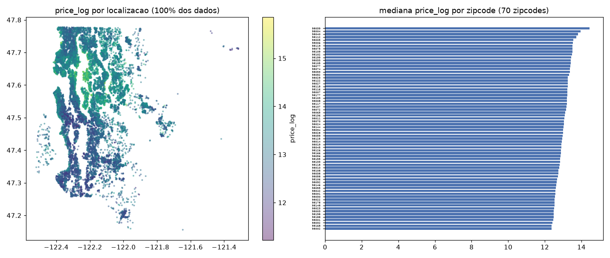

## Descoberta de representação geográfica (novo)

`n` de imóveis por zipcode varia de 50 a 601. **3 zipcodes com menos de 100 imóveis**: 98039, 98148,
98024. **Achado relevante:** `98039` (Medina) é simultaneamente o zipcode mais caro e um dos mais
escassos em volume de dado (50 imóveis) — motiva a fase 04 (`geographic_coverage`) a checar formalmente
se escassez de dado correlaciona com erro, antes de decidir sobre augmentation.

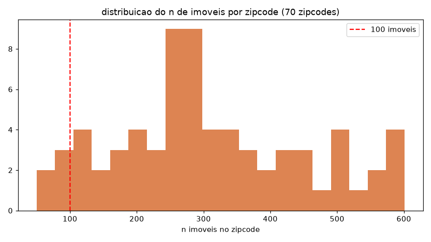

## Extensão exploratória (2026-08-17)

Ad-hoc, sem alterar `scripts/run_eda.py` nem os artefatos formais da fase.

- **Distribuição de preço:** `price` bruto tem skew 4,02; `price_log` reduz para 0,43 — reforça a
  escolha do alvo em log.
- **Correlação completa (45 colunas numéricas, não só as 16 do pipeline formal):** blocos de
  colinearidade forte dentro de tamanho (`sqft_living`/`sqft_above`/`sqft_living15`) e dentro do bloco
  demográfico/educacional (`hous_val_amt`/`medn_hshld_incm_amt`/`per_bchlr`/`edctn_*`).
- **Cruzamentos comuns de mercado:** `grade`, `sqft_living`, `bathrooms` com relação monotônica clara
  com `price`; `waterfront`/`view` raros mas com prêmio de preço visível; efeito de reforma e idade do
  imóvel mais ruidosos olhando o preço bruto sem controlar outras variáveis.

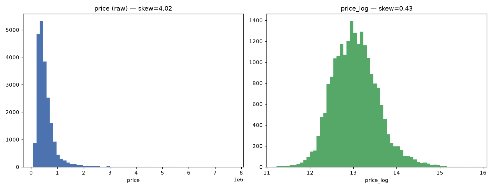
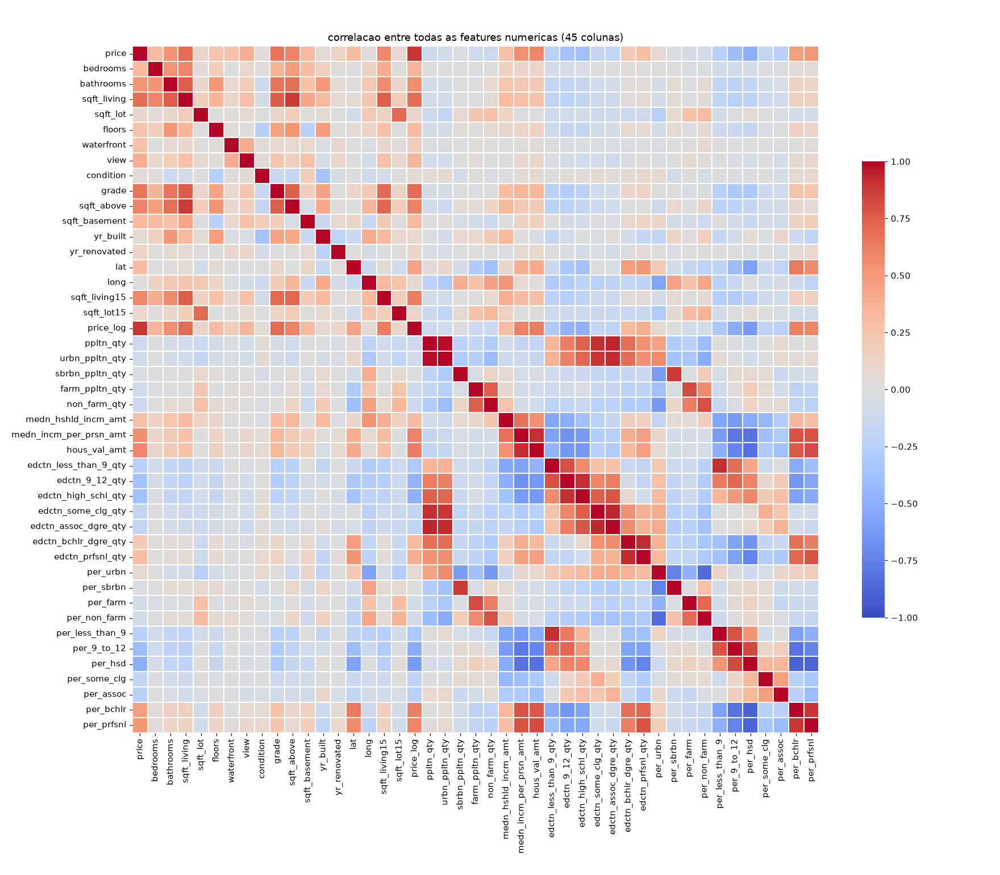
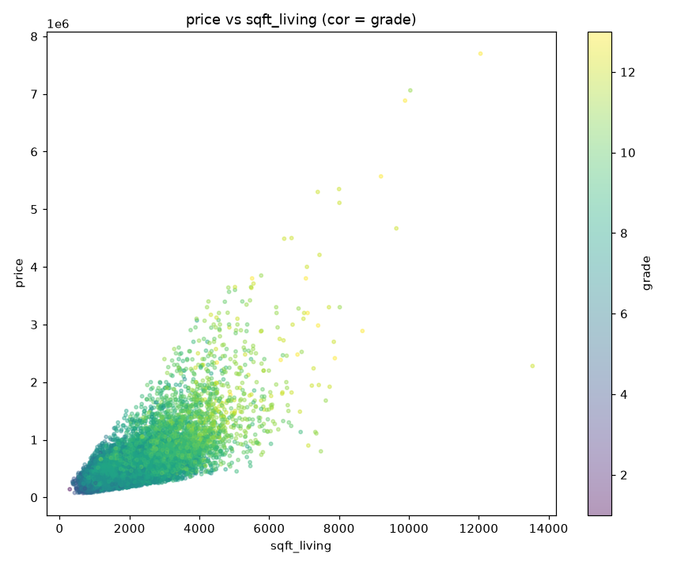
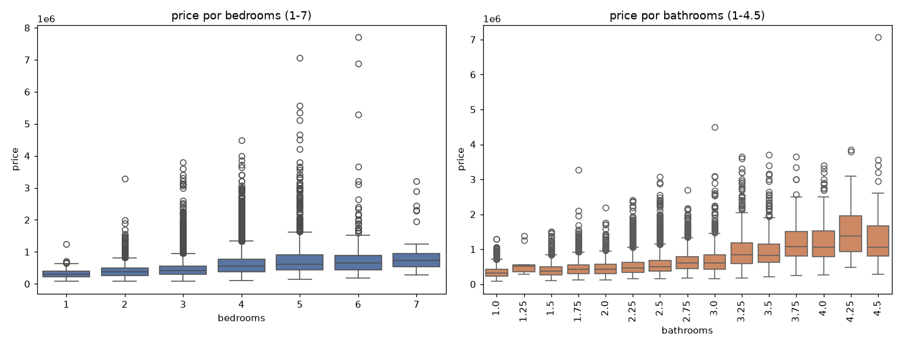
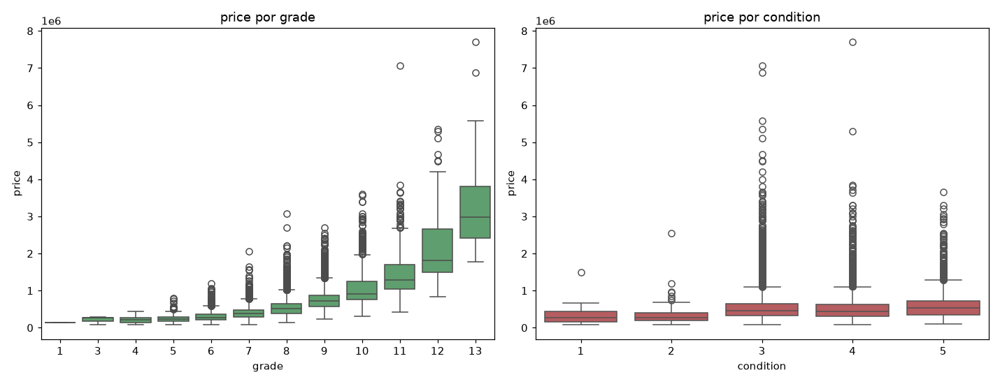
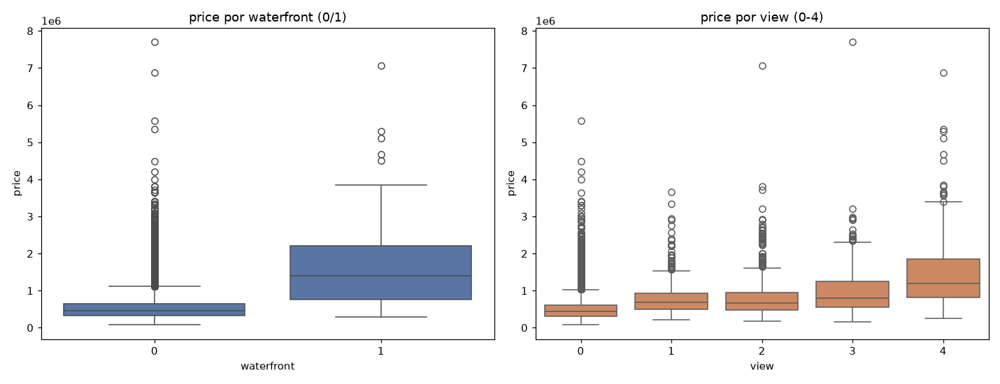
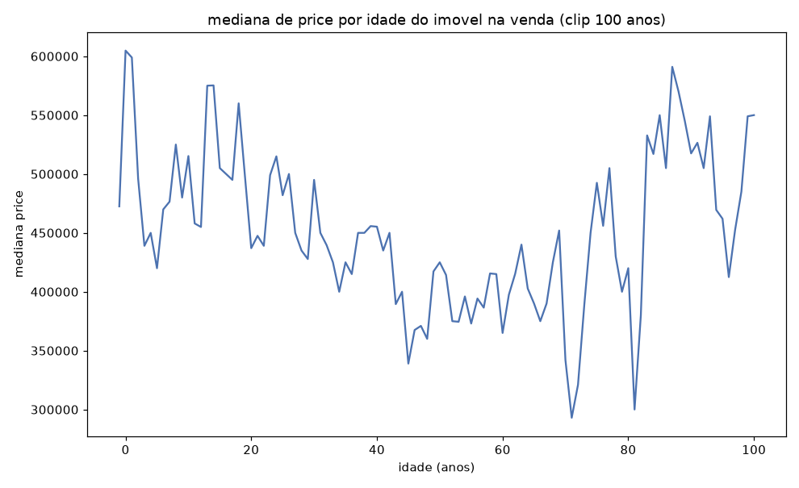
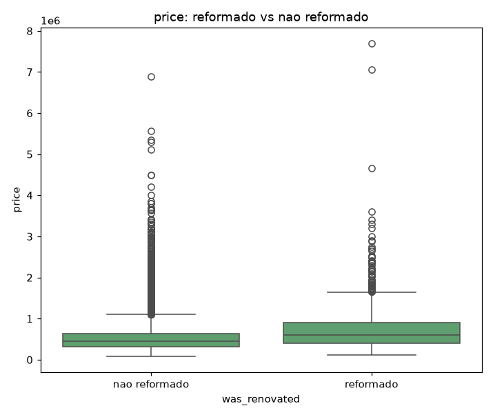
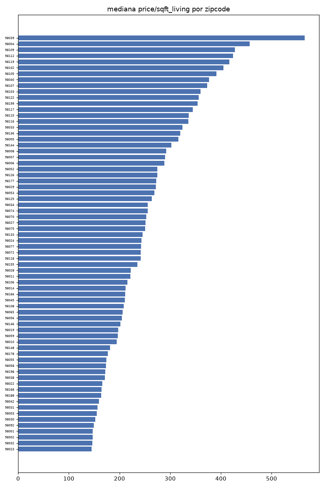

## Validado vs. descartado

- **Validado:** estrutura espacial forte; representação desigual por zipcode é real, não suposição.
- **Descartado:** nenhuma decisão de feature/modelo — fase é só leitura (P1).

## Decisão

Fase 03 (split) e fase 04 (cobertura geográfica) seguem informadas por esta EDA.

## Artefatos

`scripts/run_eda.py`, `reports/eda_summary.json`, `reports/zip_representation_summary.csv`,
`reports/figures/02_correlation_price_log.png`, `reports/figures/02_geo_price_pattern.png`,
`reports/figures/02_zip_volume_distribution.png`, `notebooks/02_eda_completo.ipynb`. Extensão:
`reports/figures/02_price_distribution.png`, `02_correlation_heatmap_full.png`,
`02_price_vs_sqft_living.png`, `02_price_by_bedrooms_bathrooms.png`, `02_price_by_grade_condition.png`,
`02_price_waterfront_view.png`, `02_price_vs_age.png`, `02_price_renovated.png`,
`02_price_per_sqft_by_zipcode.png`.
