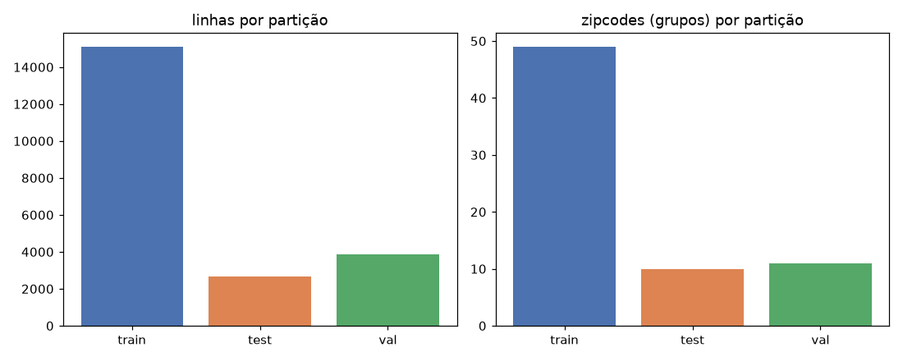

# Fase 03 — Split canônico (canonical_split)

**Pergunta:** como garantir que a avaliação reflita zipcode nunca visto?

**Hipótese:** split geográfico por grupo (`zipcode`) é a validação principal, não `train_test_split`
aleatório. Roda depois da fase 02 (EDA completo sobre 100% dos dados).

**Execução:** `src/validation/split.py` (`canonical_split`), `scripts/create_split.py`, narrado em
`notebooks/03_canonical_split.ipynb`. Testado em `tests/test_split.py` (5 casos).

## Resultado

| Partição | Linhas | % | Zipcodes |
|---|---|---|---|
| train | 15.100 | 69,87% | 49 |
| test | 2.644 | 12,23% | 10 |
| val | 3.868 | 17,90% | 11 |

`group_overlap`: nenhum. `resales_spanning_splits`: 0.

## Papel de cada partição (P1, formalizado nesta reestruturação)

`train` ajusta o modelo (e recebe augmentation, se a fase 05 confirmar). `test` é um cheque repetível de
zipcode não visto durante o desenvolvimento (fases 06-12) — relatado, nunca decide sozinho. `val` só é
tocado **uma única vez**, na fase 13.

## Decisão

Split aceito. Segue para fase 04 (cobertura geográfica), motivada pelo achado da fase 02 (zipcode 98039
é simultaneamente o mais caro e um dos mais escassos em volume).

## Artefatos

`src/validation/split.py`, `scripts/create_split.py`, `tests/test_split.py`,
`data/processed/split_assignment.parquet`, `data/processed/split_metadata.json`,
`reports/figures/03_split_distribution.png`, `notebooks/03_canonical_split.ipynb`.
