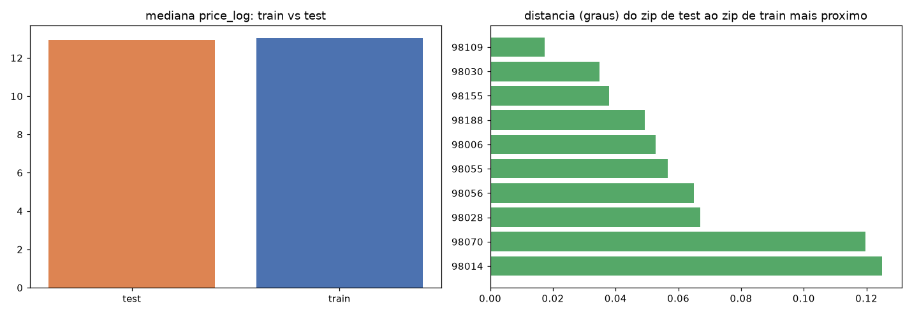
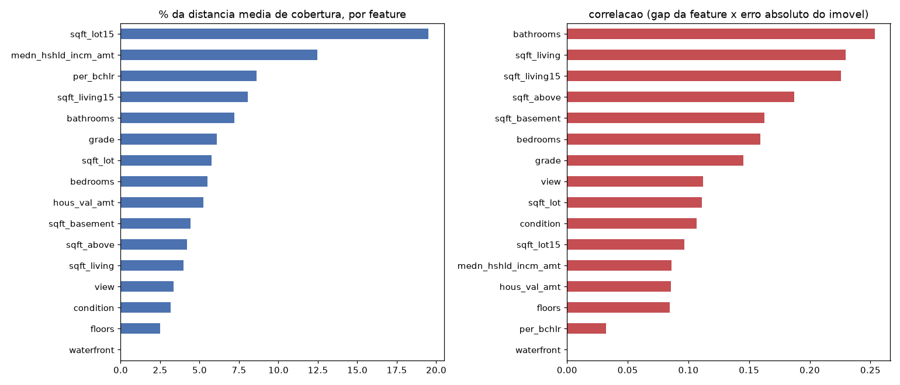
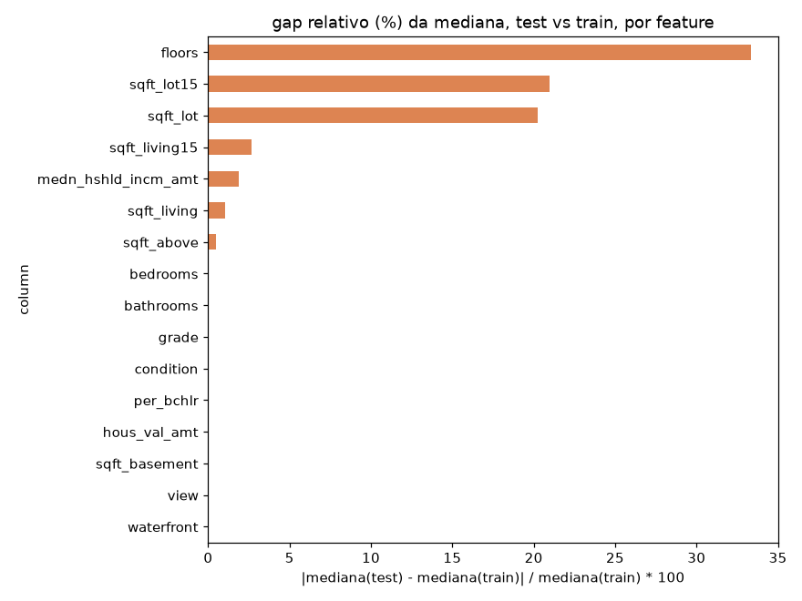
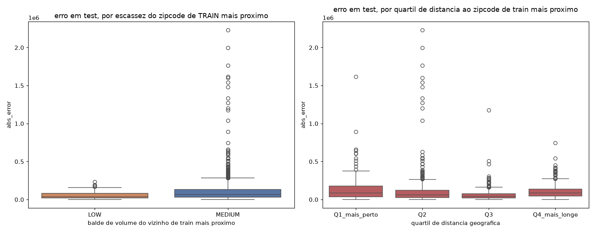

# Fase 04 — Geographic Coverage & Data Sufficiency

**Pergunta:** o split tem zipcodes/regiões sub-representadas em `train`? Isso correlaciona com erro o
suficiente para justificar augmentation?

**Hipótese:** `98039` (fase 02) é simultaneamente o mais caro e um dos mais escassos — se escassez/
distância correlacionar com erro em `test`, há evidência real (não suposição) para investigar
augmentation.

**Execução:** `scripts/analyze_geographic_coverage.py`, `src/evaluation/geographic_coverage.py`,
narrado em `notebooks/04_geographic_coverage.ipynb`. `val` deliberadamente fora desta análise (P1).

## Resultado

- **3 zipcodes `LOW`** em `train` (n<100: 98024, 98039, 98148); 40 `MEDIUM`; 6 `HIGH`.
- **Distância geográfica (zip test → zip train mais próximo):** 0,017° a 0,125° — nenhum isolamento
  geográfico extremo. Correlação com erro: **r=-0,027 (p=0,17), não significativa.**
- **Distância no espaço de features (baseline treinado em `train`, features cruas):** correlação com
  erro absoluto em `test`: **r=0,236 (p≈9×10⁻³⁵), altamente significativa.**



## Árvore de decisão

```
TRAIN tem regiões pouco representadas?   SIM (3 zips LOW)
Erro associado a baixa cobertura?        SIM (feature-space, r=0.236, p<0.001) — NÃO via distância geográfica pura
```

**Veredito: hipótese de augmentation = STRONG.** O sinal real é "imóvel fisicamente atípico frente ao
que `train` cobre", não "zipcode geograficamente isolado" — orienta a fase 05 para técnicas que reforcem
cobertura de features (SMOGN), não tentativas de "cobrir mais zipcode" (que não faria sentido, zipcode
não é feature, P1).

## Extensão exploratória (2026-08-17)

Ad-hoc, sem alterar `scripts/analyze_geographic_coverage.py`. Três achados novos:

1. **Holdout geográfico completo, não explícito na versão original:** `train` tem 49 zipcodes, `test`
   tem 10 — **interseção = 0**. Não é "alguns zipcodes escassos", é "nenhum zipcode de `test` jamais
   apareceu em `train`" (split `GroupShuffleSplit` por zipcode, fase 03). Justifica de raiz a regra
   P1 de nunca usar `zipcode` como feature — qualquer estatística por identidade de zip é, por
   construção, inútil em `test`.
2. **Decomposição da distância de cobertura por feature:** `sqft_lot15`, `medn_hshld_incm_amt`,
   `per_bchlr` são as que mais contribuem pro gap agregado; mas o que mais correlaciona com o **erro
   real** por imóvel é dominado por tamanho — `bathrooms` (r=0,25), `sqft_living` (r=0,23),
   `sqft_living15` (r=0,22), `sqft_above` (r=0,18), `sqft_basement` (r=0,16).
3. **Drift de distribuição concentrado em poucas colunas:** `floors` (33% de gap relativo na mediana),
   `sqft_lot15` (21%), `sqft_lot` (20%) — maioria das outras features com gap ≈0%.
4. **Erro por escassez do zipcode de `train` mais próximo + quartil de distância:** distância
   geográfica em quartil não é monotônica com erro (Q1 mais perto = pior erro médio que Q3) — reforça
   o veredito original (r=-0,027, ns) com mais granularidade.





Motivou 3 features candidatas nas fases 07/08 (`bathrooms_per_bedroom`, `sqft_living_to_lot_ratio`,
`dist_to_nearest_train_zip`, `comps_knn_neighbor_distance`) — testadas e **rejeitadas** na fase 09
(efeito real mas abaixo do corte de 5% de melhoria; ver `09_feature_validation.md`).

## Validado vs. descartado

- **Validado:** escassez real em `train`; distância no espaço de features prediz erro; holdout
  geográfico é completo (0 overlap de zipcode entre `train`/`test`).
- **Descartado:** distância geográfica pura como explicação do erro (mesmo em quartil, não monotônica).

## Decisão

Prosseguir para fase 05 — testar as 2 técnicas de augmentation com rigor completo, usando o veredito
STRONG como orientação de expectativa, não como bypass do teste real.

## Artefatos

`scripts/analyze_geographic_coverage.py`, `reports/geographic_coverage.json`,
`reports/figures/04_geographic_coverage.png`, `notebooks/04_geographic_coverage.ipynb`. Extensão:
`reports/figures/04_feature_coverage_decomposition.png`, `04_full_distribution_gap.png`,
`04_error_by_scarcity_bucket.png`.
