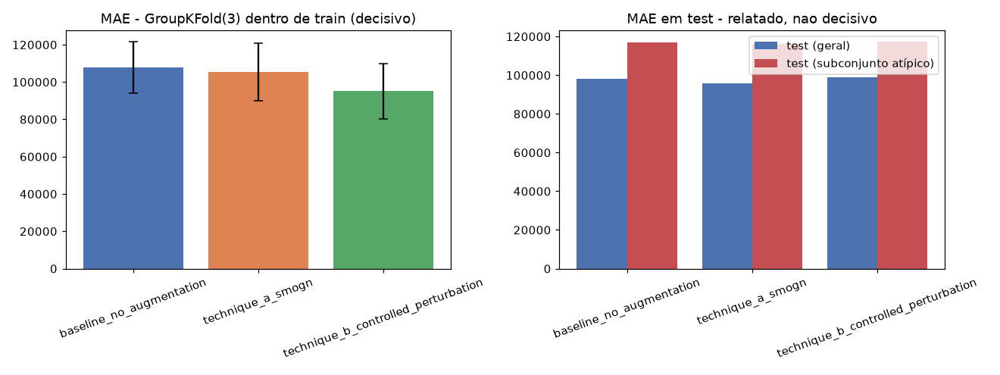

# Fase 05 — Data Augmentation Experiment

**Pergunta:** data augmentation melhora a robustez do `train` sem contaminar `test`/`val`?

**Hipótese (fase 04, STRONG):** erro correlaciona com distância no espaço de features — augmentation
deveria ajudar, especialmente no subconjunto "atípico" de `test`.

**Execução:** `src/augmentation/smogn.py`, `src/augmentation/perturbation.py`,
`scripts/run_augmentation_experiment.py`, narrado em `notebooks/05_augmentation_experiment.ipynb`.
Testado em `tests/test_augmentation.py` (8 casos). Critério de aceite definido antes: MAE de
`GroupKFold(3)` dentro de `train` cai ≥2% sobre baseline sem augmentation.

## Resultado

| Variante | n train | MAE CV (decisivo) | MAE test geral | MAE test atípico |
|---|---|---|---|---|
| Baseline (sem augmentation) | 15.100 | 107.515 ± 14.836 | 97.416 | 116.334 |
| Técnica A — SMOGN | 18.137 | 112.366 ± 7.243 (+4,5%, pior) | 96.830 | 117.190 |
| **Técnica B — perturbação controlada** | 22.650 | **95.276 ± 14.475 (-11,4%)** | 97.397 | 116.144 |

## Decisão e ressalva honesta

**Técnica A (SMOGN) rejeitada** — piora o MAE de CV (+4,5%), embora reduza a variância entre folds.

**Técnica B (perturbação) adotada** — atinge o critério pré-registrado (-11,4%, folga confortável
acima do limiar de 2%). **Ressalva:** o ganho quase não aparece em `test` (geral ou subconjunto
atípico da fase 04) — sugere que o mecanismo real é tornar `train` mais denso perto de pontos já
existentes (reduz variância de CV), não necessariamente estender cobertura para o tipo de imóvel
atípico que motivou a hipótese. Regra pré-registrada respeitada mesmo assim (P4: não mover a régua
depois de ver o resultado), com a ressalva documentada para quem auditar depois.

## Validado vs. descartado

- **Validado:** Técnica B atinge o critério pré-registrado.
- **Descartado:** Técnica A (SMOGN).
- **Achado honesto:** melhoria de Técnica B não se traduz claramente em ganho no segmento que motivou a
  investigação (subconjunto atípico de `test`).

## Decisão

`data/trusted/train_for_pipeline.parquet` (22.650 linhas, Técnica B) segue para as fases 06+.
`test`/`val` permanecem 100% reais.

## ⚠ Decisão revisada na fase 12

O Error Matrix da fase 11 mostrou que esta decisão, embora correta pela regra pré-registrada, piorou o
MAE em `test` em ~8,8%. A fase 12 testou reverter (com o pipeline completo, não só este diagnóstico) e
confirmou: sem augmentation é ~6,3% melhor em `test`. **Decisão revertida — `train_for_pipeline.parquet`
voltou a ser o `train` original.** Esta entrada permanece como registro histórico da decisão original e
do seu racional (P4: não apagar histórico, só corrigir para frente). Ver
[`12_hypothesis_revert_augmentation.md`](12_hypothesis_revert_augmentation.md).

## Artefatos

`src/augmentation/smogn.py`, `src/augmentation/perturbation.py`,
`scripts/run_augmentation_experiment.py`, `tests/test_augmentation.py`,
`reports/augmentation_experiment.json`, `data/trusted/train_for_pipeline.parquet`,
`reports/figures/05_augmentation_comparison.png`, `notebooks/05_augmentation_experiment.ipynb`.
