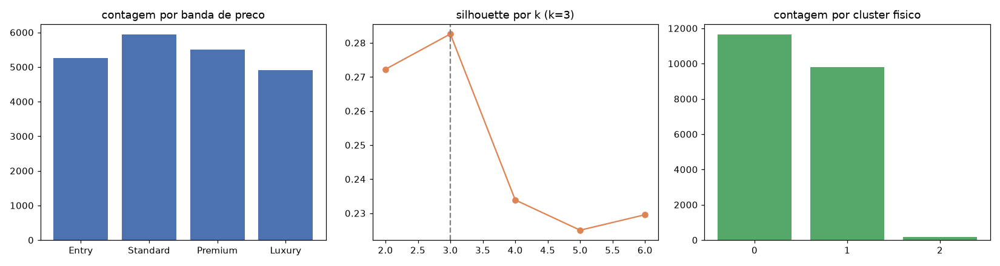
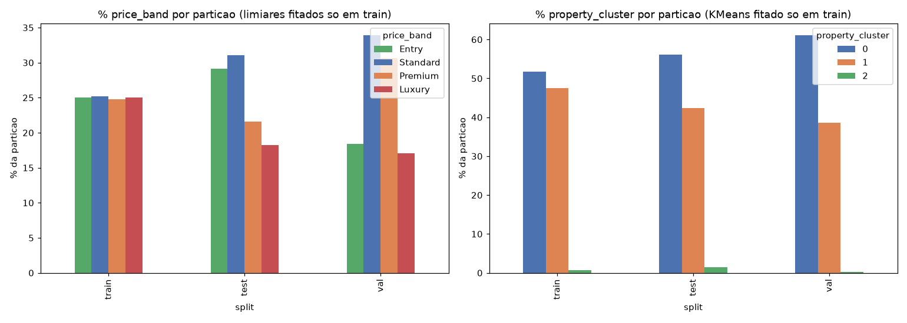
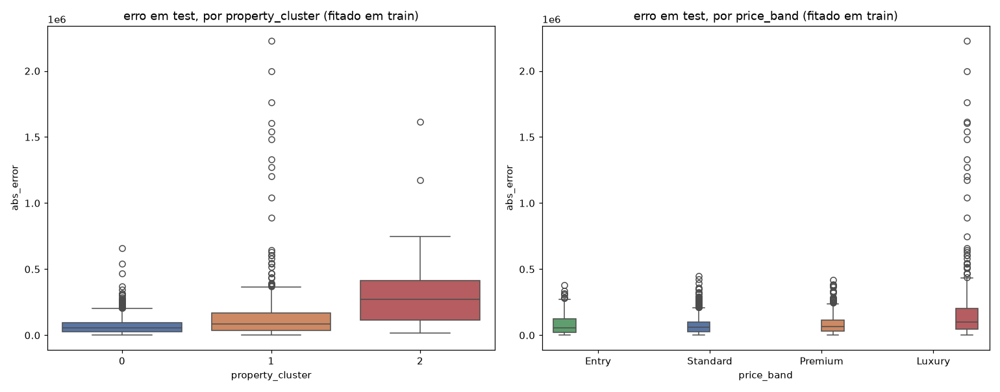

# Fase 06 — Segmentação de mercado e perfil físico

**Pergunta:** como o mercado se segmenta por preço e por perfil físico?

**Hipótese:** banda de mercado e cluster de perfil físico capturam mecanismos distintos (P3).

**Nota (pós fase 12):** a fase 05 havia adotado augmentation; a fase 12 reverteu após o Error Matrix
(fase 11) mostrar piora em `test`. Esta versão roda sobre `train` **sem** augmentation (15.100 linhas).

**Execução:** `src/segmentation/price_bands.py`, `src/segmentation/property_clusters.py`,
`scripts/run_segmentation.py`, narrado em `notebooks/06_market_property_segmentation.ipynb`.

## Resultado

Banda de preço (quartis de `price_log`, fit no `train`): `Entry` 5.259, `Standard` 5.940, `Premium`
5.496, `Luxury` 4.917. Cluster físico k=3: moderno/grande (11.651), antigo/compacto (9.798), luxo
físico raro (163). Números idênticos aos da execução original (antes da reestruturação) — esperado,
sem augmentation o `train` é o mesmo dataset.

## Extensão exploratória (2026-08-17)

Ad-hoc, sem alterar `scripts/run_segmentation.py`. `price_band`/`property_cluster` são fitados só em
`train` (49 zipcodes) e aplicados em `test`/`val` (holdout geográfico completo, fase 03/04) — a fase
original nunca conferiu se isso se sustenta em zipcodes 100% novos.

1. **Instabilidade fora de grupo, direção varia por partição (assinatura de artefato do split, não do
   mercado):** `price_band` `Luxury` cai de 25% (train) pra 18,23% em `test` e 17,06% em `val`. Mas
   `property_cluster` 2 ("luxo físico raro") **sobe** de 0,75% (train) pra 1,44% em `test` e **cai**
   pra 0,31% em `val` — direções opostas pro mesmo cluster confirmam que a proporção de um segmento
   raro numa partição depende de qual zipcode caiu ali, não de viés sistemático de mercado.
2. **Mas os segmentos capturam sinal real de erro** (reusa o modelo diagnóstico da fase 04):
   `property_cluster` 2 tem erro médio de **\$313.057** em `test` vs \$70.283 (cluster 0) e \$126.049
   (cluster 1) — 4,5x pior. `price_band` `Luxury` tem erro médio de **\$173.107**, quase o dobro de
   `Entry` (\$79.565).

**Conclusão pra feature engineering:** `property_cluster` categórico carrega sinal real mas é instável
sob este split — motivou `property_cluster_distance` (distância contínua ao centróide) como candidata
na fase 07, testada e **rejeitada** na fase 09 (efeito real, abaixo do corte de 5%; ver
`09_feature_validation.md`).

## Validado vs. descartado

- **Validado:** metodologia estável sobre `train` aumentado, perfis interpretáveis e consistentes com
  a execução anterior; segmentos carregam sinal de erro real (extensão).
- **Descartado:** nada novo na execução original — reexecução sobre a base atualizada; `property_cluster`
  bruto como feature categórica direta (instável entre partições, extensão).

## Decisão

`data/trusted/house_segments.parquet` pronto para engenharia de features (fases 07-08).

## Artefatos

`scripts/run_segmentation.py`, `data/trusted/house_segments.parquet`,
`data/trusted/price_quartiles.json`, `artifacts/property_cluster_model.pkl`,
`reports/segmentation_report.json`, `reports/figures/06_segmentation.png`,
`notebooks/06_market_property_segmentation.ipynb`. Extensão:
`reports/figures/06_segment_stability_out_of_group.png`, `06_error_by_segment.png`.
