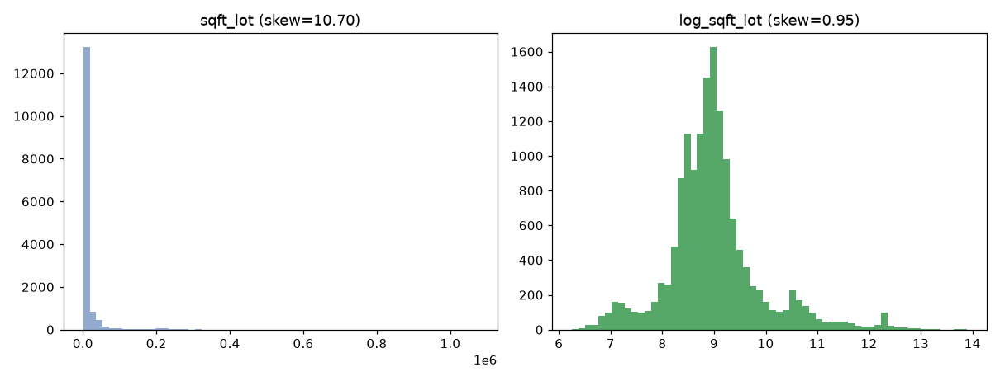
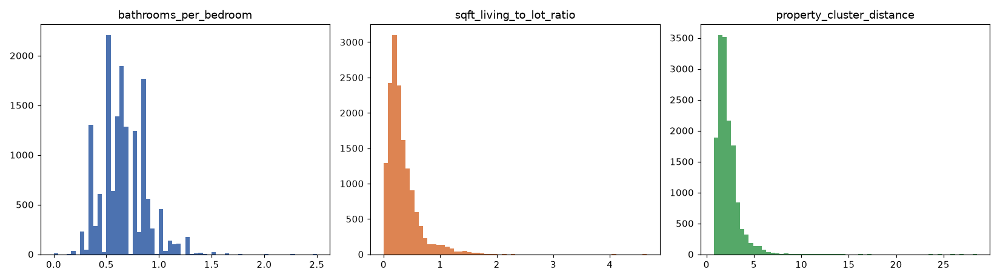

# Fase 07 — Feature engineering RAW/DERIVED

**Pergunta:** que mecanismos físicos/temporais/qualidade ainda não estão representados?

**Hipótese:** parte do sinal está em interação/transformação, não em variáveis independentes novas.

**Nota (pós fase 12):** roda sobre `train` **sem** augmentation (decisão da fase 05 revertida).

**Execução:** `src/features/raw.py`, `src/features/derived.py`, `scripts/generate_features.py`,
narrado em `notebooks/07_feature_engineering_raw_derived.ipynb`. Testado em `tests/test_features.py`.

## Resultado (correlação bruta com `price_log`, train — só triagem)

| Feature | corr(price_log) |
|---|---|
| `grade_condition_interaction` | 0,530 |
| `has_basement` | 0,193 |
| `log_sqft_lot` | 0,162 |
| `basement_ratio` | 0,152 |
| `was_renovated` | 0,124 |
| `years_since_renovation` | 0,073 |

Números idênticos aos da execução original (pré-reestruturação).

## Candidatas novas (2026-08-17) — dirigidas pelos achados das fases 04/06

As 6 features acima seguem mecanismo CONDITION/AGE (já fraco desde a EDA, `condition` r=0,039). 3
candidatas novas miram SIZE/cobertura, com evidência direta das extensões exploratórias:

| Feature | corr(price_log) | Motivação |
|---|---|---|
| `property_cluster_distance` | 0,338 | Extensão fase 06: cluster raro (luxo físico) tem erro 4,5x pior em `test`, mas instável entre partições — distância contínua ao centróide (reusa `KMeans` da fase 06, sem novo fit) preserva o sinal |
| `bathrooms_per_bedroom` | 0,302 | Extensão fase 04: `bathrooms` é a feature crua cujo gap de cobertura train→test mais correlaciona com erro (r=0,25) |
| `sqft_living_to_lot_ratio` | 0,172 | Extensão fase 04: `sqft_lot`/`sqft_lot15` têm maior drift de distribuição train→test (20-21%); `log_sqft_lot` (acima) já rejeitado olhando só MAE médio |

## Decisão

`data/trusted/features_raw_derived.parquet` gerado, agora com 9 features candidatas (6 originais + 3
novas). Decisão real de manter/descartar cada feature é da ablation (fase 09) — **as 3 novas foram
testadas e rejeitadas** (efeito real de ~1-1,5% em conjunto com as 3 da fase 08, abaixo do corte de 5%
definido como critério; ver `09_feature_validation.md`).

## Artefatos

`src/features/raw.py`, `src/features/derived.py`, `data/trusted/features_raw_derived.parquet`,
`reports/figures/07_raw_derived.png`, `notebooks/07_feature_engineering_raw_derived.ipynb`. Candidatas
novas: `reports/figures/07_new_candidates.png`, `src/features/physical_typicality.py`,
`data/processing/feature_registry.csv` (3 linhas novas, status `rejected`).
