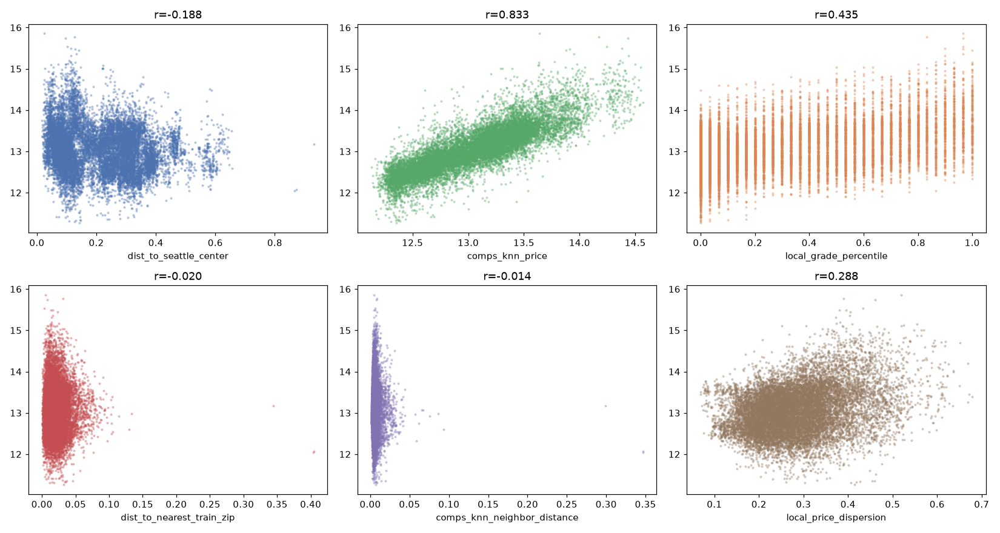

# Fase 08 — Feature engineering CONTEXTUAL

**Pergunta:** que mecanismo de localização/comparável/posição relativa falta?

**Hipótese:** índice espacial de vizinhos (KNN, k=30, fit só em `train`) captura sinal de mercado local
mais fino que a média por zipcode.

**Nota (pós fase 12):** índice refit sobre `train` **sem** augmentation.

**Execução:** `src/features/neighborhood.py`, `src/features/comparable.py`,
`src/features/relative_position.py`, `scripts/generate_features.py`, narrado em
`notebooks/08_feature_engineering_contextual.ipynb`.

## Resultado

| Feature | r TRAIN | r TEST | gap |
|---|---|---|---|
| `comps_knn_price` | 0,833 | 0,601 | -0,232 |
| `local_grade_percentile` | 0,436 | 0,504 | +0,068 |
| `dist_to_seattle_center` | -0,188 | -0,190 | -0,002 |

Números idênticos aos da execução original: `comps_knn_price` mais forte em TRAIN, perde correlação em
TEST (efeito de generalização geográfica, não leakage — índice fit só em TRAIN, self-match excluído).

 — figura atualizada em 2026-08-17, 6 painéis (3 originais +
3 candidatas novas abaixo).

## Candidatas novas (2026-08-17) — dirigidas pelos achados das fases 04/08

Todas reusam índices já fitados em `train` (sem novo `.fit`):

| Feature | r TRAIN | r TEST | Motivação |
|---|---|---|---|
| `local_price_dispersion` | 0,289 | 0,115 | Desvio-padrão do `price_log` entre os mesmos k=30 vizinhos de `comps_knn_price` — heterogeneidade do mercado local |
| `dist_to_nearest_train_zip` | -0,020 | -0,050 | Promove o diagnóstico da fase 04 (`nearest_train_zip_distance`) a feature real, por imóvel |
| `comps_knn_neighbor_distance` | -0,014 | -0,051 | Distância média aos k=30 vizinhos de `comps_knn_price` — ataca direto o gap -0,232 medido acima |

`dist_to_nearest_train_zip`/`comps_knn_neighbor_distance` têm correlação isolada com `price_log`
próxima de zero — **esperado**, não desenhadas pra prever preço sozinhas, mas pra modular
`comps_knn_price` via interação não-linear (XGBoost captura, Pearson marginal não enxerga).

## Decisão

`data/trusted/features_contextual.parquet`, `artifacts/spatial_index.pkl` gerados (índice fit sobre
`train`; `spatial_index.pkl` agora também carrega `train_zip_index`). 6 features candidatas ao todo (3
originais + 3 novas). Decisão de promoção fica para a fase 09 (ablation) — **as 3 novas foram testadas
e rejeitadas** (efeito real de ~1-1,5% em conjunto com as 3 da fase 07, abaixo do corte de 5%; ver
`09_feature_validation.md`).

## Artefatos

`src/features/neighborhood.py`, `src/features/comparable.py`, `src/features/relative_position.py`,
`data/trusted/features_contextual.parquet`, `artifacts/spatial_index.pkl`,
`reports/figures/08_contextual.png`, `notebooks/08_feature_engineering_contextual.ipynb`.
`data/processing/feature_registry.csv` (3 linhas novas, status `rejected`).
