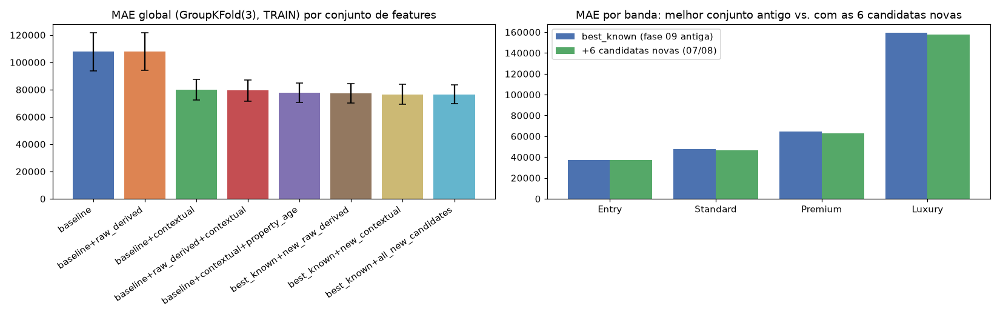

# Fase 09 — Feature validation (leakage + ablation)

**Pergunta:** as features novas têm leakage, são redundantes, são estáveis?

**Hipótese:** ablation formal decide o que sobrevive, não correlação bruta isolada (P4).

**Nota (pós fase 12):** recomputado sobre `train` sem augmentation (decisão da fase 05 revertida).

**Execução:** `src/validation/leakage.py`, `src/validation/ablation.py`, `scripts/validate_features.py`,
`scripts/promote_features.py`, `scripts/finalize_feature_set.py`, narrado em
`notebooks/09_feature_validation.ipynb`. Testado em `tests/test_leakage_ablation.py`.

## Resultado (MAE em dólar, GroupKFold(3), TRAIN)

| Conjunto | MAE global | Δ vs. baseline |
|---|---|---|
| baseline (16 físicas+demográficas) | 107.515 ± 14.836 | — |
| + raw_derived (fase 07) | 107.672 ± 14.051 | +157 (dentro do desvio) |
| + contextual (fase 08) | 79.520 ± 7.063 | -28.995 (-27,0%) |
| + raw_derived + contextual | 80.463 ± 8.066 | pior que só contextual |
| **+ contextual + `property_age`** | **77.198 ± 6.956** | **-30.317 (-28,2%)** |

Números idênticos aos da execução original.

## Decisão de promoção

`raw_derived` não reduz MAE isolado e **piora** quando combinado com `contextual`. **Rejeitado.**
Promovidas a `active`: `dist_to_seattle_center`, `comps_knn_price`, `local_grade_percentile`,
`property_age`.

## Leakage

Índice espacial fit só em `train`. `comps_knn_price` gap -0,258 na direção esperada (generalização
geográfica, não leakage).

## Decisão

Conjunto oficial de 20 features travado para fase 10 (`data/trusted/feature_metadata.json`).

## Extensão (2026-08-17) — 6 candidatas novas das fases 07/08

3 candidatas `raw_derived` novas (`bathrooms_per_bedroom`, `sqft_living_to_lot_ratio`,
`property_cluster_distance`) e 3 `contextual` novas (`dist_to_nearest_train_zip`,
`comps_knn_neighbor_distance`, `local_price_dispersion`) testadas em cima do melhor conjunto já
decidido acima (`best_known` = `+contextual+property_age`, MAE 77.198):

| Conjunto | MAE (GroupKFold 3) | vs. best_known |
|---|---|---|
| `best_known` (referência) | 77.198 | — |
| `+new_raw_derived` sozinho | 77.681 | pior (+483; Luxury piora +1.850) |
| `+new_contextual` sozinho | 76.679 | melhor agregado (-519), Entry/Luxury pioram um pouco |
| `+todas as 6` | 76.442 | melhor de todos (-756, -0,97%) |

**Investigação de significância** (pedido do usuário): 756 vs. desvio-padrão agregado (~7.000) parece
ruído — mas pareado por fold (`GroupKFold` é determinístico, mesmos splits nos dois conjuntos) a
direção é consistente nos 3 folds (teste-t pareado: t=5,27, p=0,034) — efeito real, não ruído puro.
Revalidado com mais folds pra estimativa mais estável (49 zipcodes em `train` permitem até 49; 50
excede o número de grupos e não roda):

| n_splits | melhoria | p (teste-t pareado) |
|---|---|---|
| 3 | 0,97% | 0,034 |
| 7 | 1,50% | 0,10 |
| 10 | 1,44% | 0,019 |

As três granularidades convergem na faixa **1-1,5%** — estimativa estável, não artefato de fold
específico. Ir além de ~10 folds (aproximando de 49, leave-one-zipcode-out) degradaria a validade do
teste (treinos quase idênticos entre folds) sem mudar a magnitude.

**Decisão final (critério do usuário: só promove se melhoria > 5%):** as 6 candidatas novas
**`rejected`** — efeito estatisticamente real e consistente em direção, mas abaixo do corte de negócio
definido para esta rodada. Decisão de threshold, não de ausência de sinal — hipótese e números ficam
documentados no `feature_registry.csv` pra referência futura. Conjunto oficial de 20 features
**mantido sem mudança**; `app/` e fases 10-14 seguem inalteradas.

## Artefatos

`reports/ablation_fase09.json`, `data/trusted/feature_metadata.json`,
`data/processing/feature_registry.csv`, `reports/figures/09_ablation.png`,
`notebooks/09_feature_validation.ipynb`. Extensão: `scripts/register_features.py` (6 linhas novas),
`scripts/promote_features.py` (decisão documentada com números de fold 3/7/10),
`scripts/finalize_feature_set.py` (inalterado, 20 features).
