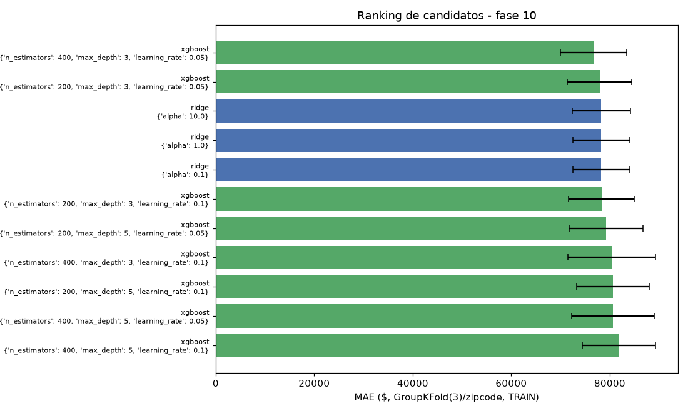

# Fase 10 — Model selection

**Pergunta:** qual modelo generaliza melhor sob validação geográfica?

**Hipótese:** escolha de features pesa mais que escolha de algoritmo. Grid enxuto Ridge+XGBoost,
`GroupKFold(3)`/zipcode.

**Nota (pós fase 12):** recomputado sobre `train` sem augmentation (decisão da fase 05 revertida).

**Execução:** `src/models/train.py`, `scripts/train_model.py`, narrado em
`notebooks/10_model_selection.ipynb`. Testado em `tests/test_model_selection.py`.

## Resultado (top de 11 candidatos)

| Rank | Modelo | Params | MAE | ±std |
|---|---|---|---|---|
| 1 | XGBoost | n_est=400, depth=3, lr=0.05 | 76.906 | 6.649 |
| 2 | XGBoost | n_est=200, depth=3, lr=0.1 | 77.253 | 6.503 |
| 3 | XGBoost | n_est=200, depth=3, lr=0.05 | 77.748 | 6.421 |
| 4 | Ridge | alpha=10.0 | 78.287 | 5.864 |
| 5 | Ridge | alpha=1.0 | 78.290 | 5.821 |

Números idênticos aos da execução original.

## Decisão

Vencedor: **XGBoost** (`n_estimators=400, max_depth=3, learning_rate=0.05`), MAE CV 76.906±6.649,
R²(log)=0.887. Empate técnico com Ridge e outros XGBoost — reportado explicitamente (P4), não escondido
no argmax.

## Artefatos

`artifacts/model_candidate.pkl`, `reports/model_selection_report.json`,
`reports/figures/10_model_selection.png`, `notebooks/10_model_selection.ipynb`.
