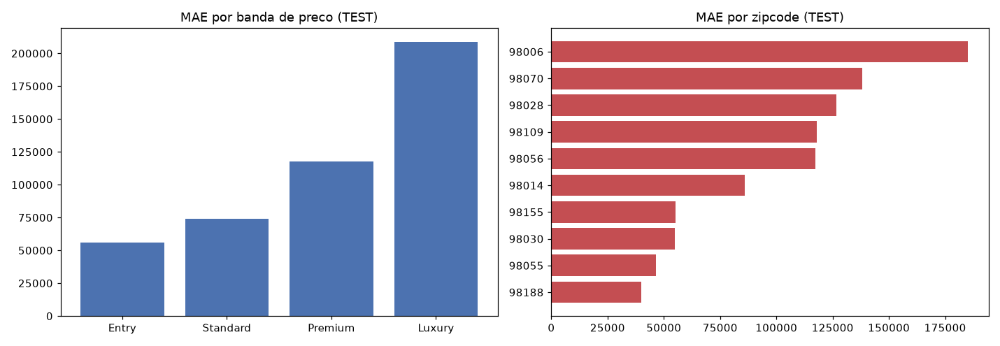

# Fase 11 — Error Matrix

**Pergunta:** onde o modelo funciona bem, onde falha? Roda só sobre `test`; `val` fica de fora (P1, só
na fase 13).

**Nota (pós fase 12):** modelo treinado sobre `train` sem augmentation (decisão da fase 05 revertida
após a primeira execução desta fase ter revelado a piora — ver `AUDIT_LOG.md`).

**Execução:** `scripts/evaluate_model.py`, `src/evaluation/error_matrix.py`, narrado em
`notebooks/11_error_matrix.ipynb`.

## Resultado — TEST (n=2.644)

MAE global **\$104.221** — de volta ao nível da execução original, confirmando que a reversão (fase
12) corrigiu a piora identificada na primeira passagem por esta fase (que era \$113.385 com
augmentation).

`Luxury` (n=482) MAE \$207.942 (~4x `Entry`, \$56.522) — mesmo padrão conhecido de mercados
imobiliários, independente da questão de augmentation. `98006` segue o zipcode mais difícil (MAE
~\$185k, 18,8% do `test`) — mesma causa raiz da execução original (zipcode caro/alta variância caiu
inteiro em `test`, só 70 zipcodes totais no dataset).

## Validado vs. descartado

- **Validado:** reverter augmentation restaura o nível de erro original — decisão corrigida
  corretamente.
- **Descartado:** CV em `train` como proxy suficiente para decisão de augmentation neste projeto (não
  descartado como prática geral, com ressalva registrada na fase 12).

## Decisão

Error Matrix final sobre `test` travado. Segue para fase 13 (refit final `train`+`test`, checagem
única em `val`).

## Artefatos

`reports/error_matrix.json`, `reports/figures/11_error_matrix.png`,
`notebooks/11_error_matrix.ipynb`.
