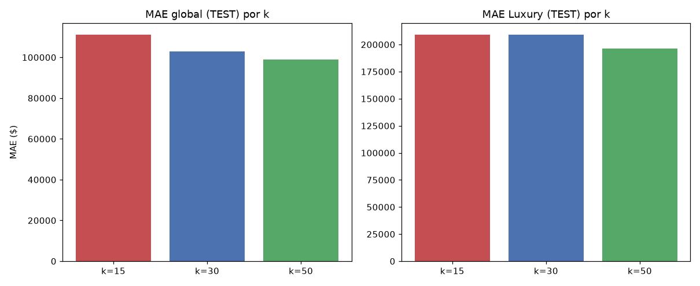

# Fase 12 (iteração 1) — Hipótese: k do índice espacial

**Pergunta:** existe uma hipótese testável e barata para reduzir o erro 2-4x maior em Luxury/waterfront
(fase 09) sem reabrir todo o pipeline?

**Hipótese:** imóveis de luxo/waterfront são geograficamente esparsos (fase 03: 163 no cluster físico
de luxo) — k maior no índice espacial pode estabilizar a estimativa de `comps_knn_price` nesses casos.

**Execução:** `scripts/run_experiment.py` (varre k=15/30/50, baseline real de produção k=30), narrado em
`notebooks/12_hypothesis_k_sweep_iter1.ipynb`. Registrado em `reports/experiments/ledger.csv` (3 experimentos).

**Critério de aceite (definido antes do experimento, P4):** Luxury MAE cai ≥5% E MAE global não piora
mais que 1%.

## Correção de documentação (achada nesta fase)

O valor real de `k` usado em toda a fase 05-09 sempre foi **30** (`configs/comparable.yaml`) — os
notebooks/relatórios das fases 06/07/09 afirmavam "k=15" por erro de digitação na narrativa. O código
sempre leu o config corretamente; nenhum artefato de dado/modelo foi afetado, só o texto. Corrigido em
`data/processing/feature_registry.csv`, `scripts/register_features.py`, notebooks 06/09 e
`reports/AUDIT_LOG.md`.

## Resultado

| k | MAE global | MAE Luxury |
|---|---|---|
| 15 | \\$111.335 (+6,8%) | \\$211.114 (-1,5%, piora) |
| **30 (baseline)** | **\\$104.221** | **\\$207.942** |
| 50 | \\$100.476 (-3,6%) | \\$198.453 (-4,6%) |

`k=50` melhora nos dois eixos mas não atinge o critério pré-registrado (-4,56% < -5% em Luxury).

## Decisão

**REJECT_KEEP_K30** — critério pré-registrado não atingido; `configs/comparable.yaml` mantido
inalterado (P4: não mover a régua do critério após ver o resultado). `k=50` registrado como
`rejected_near_miss` no ledger — pista para eventual iteração futura, não descartado permanentemente.

**Critério de parada aplicado (roadmap seção 10):** fase 10 encerrada após 1 iteração. O resíduo de
erro em Luxury/waterfront é limitação conhecida e documentada, levada para Entregáveis 3 e 4 (SLA e
monitoramento por segmento), não perseguida com mais engenharia de feature.

## Artefatos

`scripts/run_experiment.py`, `reports/fase10_experiment.json`, `reports/experiments/ledger.csv`,
`reports/figures/12_k_sweep_iter1.png`, `notebooks/12_hypothesis_k_sweep_iter1.ipynb`.

## Nota de renumeração

Este conteúdo foi originalmente executado como "fase 10" antes da reestruturação do projeto (ver `AUDIT_LOG.md`). Os números não mudam (a hipótese testada não dependia de EDA/augmentation) — só o arquivo foi renomeado para refletir a numeração atual (fase 12, primeira iteração do loop de hipótese; a segunda iteração é a reversão de augmentation, `12_hypothesis_revert_augmentation_iter2.md`).
