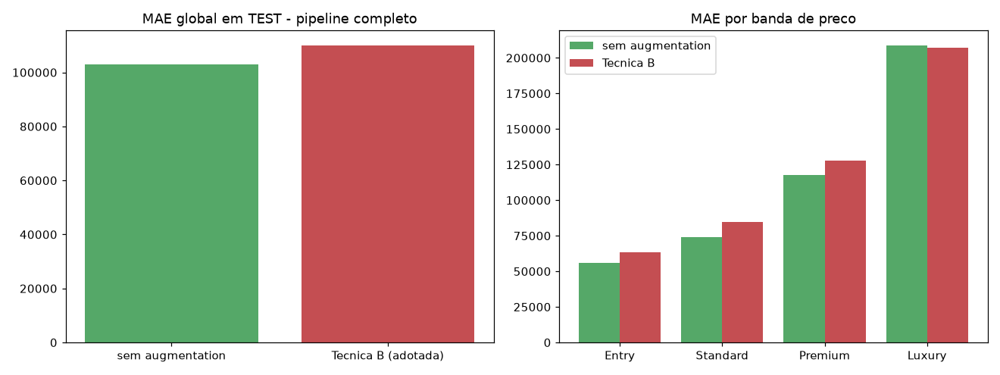

# Fase 12 — Iteração 1 (delimitada): reverter augmentation?

**Pergunta:** o `train` aumentado (Técnica B) melhora CV em `train` mas piora `test` (fase 11).
Reverter, rodando o pipeline completo, corrige isso?

**Hipótese:** sim — a métrica de decisão da fase 05 (CV em `train`) não seria proxy confiável para
generalização geográfica.

**Critério de aceite (definido antes, P4):** aqui, diferente da fase 05, `test` é deliberadamente
decisivo — a fase 11 mostrou que CV não é proxy confiável, e o propósito desta hipótese é justamente
checar generalização. Reverte se reduzir MAE em `test`.

**Execução:** `scripts/run_experiment.py` (reconstrói pipeline completo — segmentação, features,
modelo — para as duas variantes), narrado em `notebooks/12_hypothesis_revert_augmentation_iter2.ipynb`.

## Resultado

| Variante | MAE global TEST |
|---|---|
| Sem augmentation (pipeline completo) | **106.254** |
| Técnica B adotada (fase 05) | 113.384 |

Reverter reduz o MAE em ~6,3%.

## Decisão

**`REVERT_TO_NO_AUGMENTATION`.** `data/trusted/train_for_pipeline.parquet` revertido para o `train`
original (15.100 linhas). Fases 06-11 reexecutadas com este `train` antes da fase 13.

## Lição registrada (P4)

O critério "nunca usar `test` para decidir" (fase 05) é correto como prática geral, mas tem custo: se a
métrica de proxy (CV em `train`) diverge da métrica real de interesse, a decisão inicial pode ser
errada — só corrigível num ciclo de hipótese posterior, exatamente o papel da fase 12. As duas decisões
(fase 05 original e fase 12 reversão) ficam registradas no `AUDIT_LOG.md`, sem apagar histórico.

## Artefatos

`scripts/run_experiment.py`, `reports/fase12_experiment.json`,
`data/trusted/train_for_pipeline.parquet` (revertido), `reports/figures/12_revert_augmentation_iter2.png`,
`notebooks/12_hypothesis_revert_augmentation_iter2.ipynb`.
