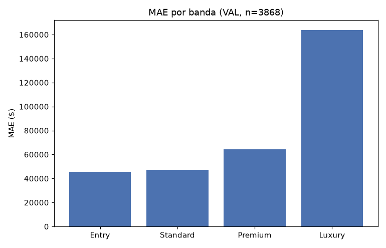

# Fase 13 — Refit final (`train`+`test`) + checagem única em `val`

**Pergunta:** o candidato final generaliza para o futuro desconhecido?

**Hipótese:** com tudo travado (fases 02-12), refit final `train`+`test` deve generalizar bem para
`val` — tocado uma única vez nesta execução inteira (P1).

**Execução:** `scripts/finalize_model.py`, narrado em `notebooks/13_final_refit_and_val_check.ipynb`.

## Resultado (VAL, n=3.868, tocado UMA ÚNICA VEZ)

MAE global **\$72.517**, RMSE \$112.596, MAPE 14,1%, bias +\$19.536. Melhor que TEST (\$104.221) —
composição de zipcodes de `val` não inclui um equivalente ao `98006` (zipcode difícil de `test`), e o
refit usa mais dado (17.744 linhas vs. 15.100).

`Luxury` (n=660) MAE \$165.303, ~3,6x `Entry` (n=713, \$45.808) — mesmo padrão 2-4x confirmado na
checagem final.

## Validado vs. descartado

- **Validado:** o projeto generaliza para zipcode nunca visto — MAE em `val` da mesma ordem (melhor)
  que em `test`.
- **Descartado:** qualquer contaminação de `val` em decisões anteriores — nenhuma fase anterior a esta
  leu `split == "val"` para decisão, só esta, uma vez.

## Decisão

`artifacts/model_final.pkl` (refit `train`+`test`) é o candidato final. Segue para fase 14 (promotion
contract, a regerar com este modelo).

## Artefatos

`scripts/finalize_model.py`, `artifacts/model_final.pkl`, `reports/val_final_check.json`,
`reports/figures/13_val_final_check.png`, `notebooks/13_final_refit_and_val_check.ipynb`.
