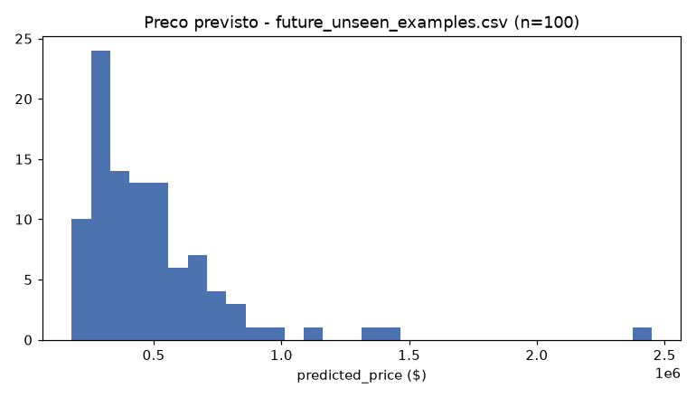

# Fase 14 — Promotion contract + demo de inferência

**Pergunta:** o candidato está pronto para virar contrato de produção?

**Hipótese:** contrato de produção precisa ser pacote atômico (P6). Usa `artifacts/model_final.pkl`
(refit `train`+`test`, fase 13) — não o `model_candidate.pkl` intermediário.

**Execução:** `scripts/write_production_contract.py`, `src/pipelines/inference.py`, `scripts/predict.py`,
narrado em `notebooks/14_promotion_contract.ipynb`. Testado em `tests/test_inference_pipeline.py`.

## Contrato gerado

`artifacts/production_contract.yaml`: modelo XGBoost (treinado em `train`+`test`, CV MAE \$76.906, MAE
em `val` \$72.517, MAPE 14,1%), 20 features, pré-processamento (índice espacial k=30, fit só TRAIN),
versões de dataset/split, contrato de validação, e **limitações conhecidas explícitas**: erro 2-4x
maior em Luxury/waterfront/grade alto; sensibilidade de TEST/VAL à composição de zipcode; lição da
reversão de augmentation (fase 05→12) registrada como aprendizado formal. `status:
RECOMMENDED_FOR_PROMOTION` — recomendação, não execução (P6).

## Demo de inferência

`future_unseen_examples.csv` (100 imóveis, sem `id`/`date`/`price`) via
`src/pipelines/inference.py::predict_price`, usando `model_final.pkl` — reusa as mesmas funções de
treino (P5). Previsões: mediana \$425.209, min \$172.360, max \$2.466.708 — plausível para King County.

## Validado vs. descartado

- **Validado:** pipeline de inferência usa o modelo final correto, sem duplicação de lógica.
- **Descartado:** promoção automática de produção — recomendação apenas (P6).

## Decisão

`artifacts/production_contract.yaml` e `reports/future_unseen_predictions.csv` prontos, refletindo o
modelo final pós-reversão de augmentation. Ponte para Entregável 3 (deploy) e Entregável 4 (aprendizado
contínuo).

## Artefatos

`src/pipelines/inference.py`, `scripts/write_production_contract.py`, `scripts/predict.py`,
`tests/test_inference_pipeline.py`, `artifacts/production_contract.yaml`,
`reports/future_unseen_predictions.csv`, `reports/inference_demo_report.json`,
`reports/figures/14_inference_demo.png`, `notebooks/14_promotion_contract.ipynb`.
